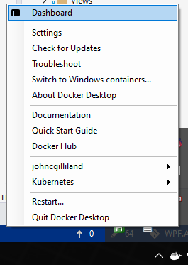

# WPF.Airprint
Demo WPF application with IPP/Airprint printer discovery and driverless printing.

### Overview
This project attempts to solve the problem of supporting uninstalled printers in a controlled OS/Kiosk environment. Specifically
when the target application is being provided as part of an OEM product. Previously we have had to offer support for a predetermined
set of printers by installing their drivers onto the OS image and then disconnecting them. The customer could then connect any of 
the *supported* printers and use them from the application.

This particular OEM/Regulated situation provides a uniquely fitting opportunity to attempt driverless printing. This is typically 
used in mobile OS applications, such as Apple's iOS and the Airprint protocol. The Airprint protocol is the predecessor of the IPP
[Internet Printing Protocol] that support printer communication over TCP. Driverless printing means that the presence of static 
driver files installed onto the OS are not required in order to perform printing operations.

##### Goals
1. Support discovery of any modern printer connected to the same domain as the target PC.
2. Support printing to any discovered and available printer connected to the domain.

### Getting Started
Late in the writing of this, a couple days before I did the presentation, I found that I could discover the IPP enabled printers using the WinRT api Windows.Devices.Enumeration. This eliminated the need to use and have installed the Bonjour SDK for Windows. The application code still contains the service class and calls needed to use the Bonjour SDK instead if you wish.

##### Required:
1. You must have the [Bonjour SDK for Windows]() installed if you do not have Windows 10 and WinRT. 
2. You must also have rebooted or manually started the Bonjour Windows Service.
3. You must have Docker for Windows installed and running. You can use either WSL2 or Hyper-V hosting.
4. Current version requires you to have the cups printer server image built locally.

To build the print server docker image you can perform the following steps:
1. Open a command prompt and cd into the project directory: `lib\cups-print-server`
2. Build the image by executing this command: `docker build -t cups-print-server .`
3. Confirm success by opening the docker applet from the system tray...

And then selecting the Images item in the left hand menu, this will show a list of the images so that you can confirm the **cups-print-server** images exists:

The required configuration and Dockerfile for the cups print server that is used by the application is provided in the core
library. 

##### Demo Application:
The included demo application offers an implementation and use of the core WPF.Airprint library in a very simple harness app that
can be used to discover network printers on the local domain where executed. Once discovered you can select one of the network 
printers and add a queue for it and print a PDF file from your local drive as a test.

> NOTE:  The issue of creating the files volume using the docker remote api prevents the actual print call from functioning in the demo.

### Futures
1. Support building the cups print server docker image instead of requiring it exist locally.
2. Implement shim for IEventAggregator in order to remove Prism dependency from core library.

